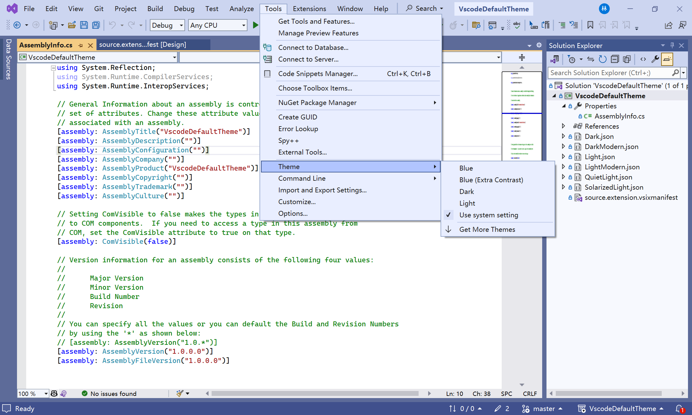
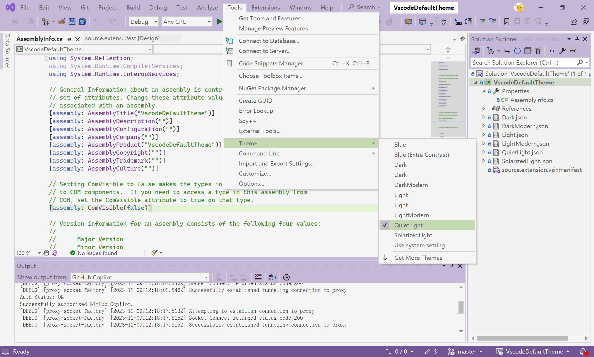

# VscodeDefaultTheme

VScode default theme for Visual Studio 2022, contains

- Dark
- Dark Modern
- Light
- Light Modern
- Quiet Light
- Solarized Light

## Installation

1. Download the latest release from here.

2. Just Click the `.vsix` file to install.

3. Restart Visual Studio and you can change the theme like this.

| Before | After |
| :---: | :---: |
|  |  |

## Reference

- [VSCode Theme Converter - Visual Studio Marketplace](https://marketplace.visualstudio.com/items?itemName=MadsKristensen.VSCodeThemeConverter)
- [Convert VS Code themes to Visual Studio - YouTube](https://www.youtube.com/watch?v=8yq7XilKaLE&list=PLReL099Y5nRdz9jvxuy_LgHFKowkx8tS4&index=9&ab_channel=MicrosoftVisualStudio)
- [Bring VS Code Themes to Visual Studio - YouTube](https://www.youtube.com/watch?v=2Gwqr5uuBt4&ab_channel=MicrosoftVisualStudio)
